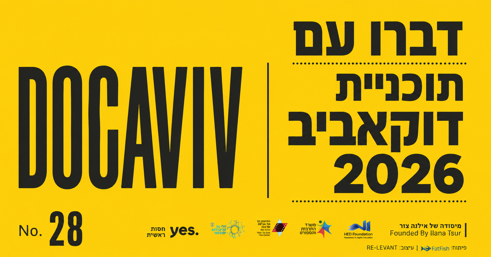

# 🎬 מתכנן דוקאביב 2026

**סקיל חינמי ל-Claude שעוזר לתכנן את הפסטיבל בצורה חכמה.**

דוקאביב 2026 מגיש 122 סרטים ו-185 הקרנות בין **28 במאי ל-6 ביוני** — בסינמטק תל אביב ובמוזיאון תל אביב. הסקיל הזה מכיר את כל הקטלוג, את לוח הזמנים, ואת כל האולמות — ויעזור לכם לבנות תכנית שמתאימה בדיוק.

---

## מה אפשר לעשות?

שאלו בעברית חופשית. לדוגמה:

> *"יש לי זמן פנוי ביום שישי ב-30 במאי — מה כדאי לראות?"*

> *"תכנן/י לי שלושה סרטים ביום ראשון ב-31 במאי, בלי חפיפות"*

> *"אילו סרטים מוקרנים פעם אחת בלבד — שאם נפספס אותם, פספסנו?"*

> *"מצאו לנו שני סרטים גב-אל-גב בערב חמישי שמתאימים למי שאוהבים סרטי מוזיקה"*

> *"מתעניינים בסרטים על שואה — מה יש בפסטיבל?"*

> *"תנו לנו מרתון נושאי שלם על נשים וכוח"*

> *"הכינו לי הודעת וואטסאפ מהתכנית לשלוח לחברים"*

Claude יחזיר תכנית מסודרת עם שעות, אולמות, קישורים לעמוד כל סרט, וקישור ישיר להזמנת כרטיסים — ואם תרצו, גם הודעת וואטסאפ מוכנה להעתקה ושיתוף, עם שם הסרט, מועד ומיקום ההקרנה, תיאור של עד חמש מילים, קישור לעמוד הסרט וקישור להזמנה.

---

## התקנה — דקה אחת

### 1. הורידו את הסקיל

**[⬇️ לחצו כאן להורדת docaviv2026.skill](https://github.com/internet-and-sons/docaviv2026/raw/main/docaviv2026.skill)**

### 2. לחצו פעמיים על הקובץ

Claude Desktop יפתח ויבקש לאשר את ההתקנה.

### 3. סיום

זהו. עכשיו פשוט שאלו את Claude מה בא לכם — בעברית, כמו שמדברים.

> נדרש: [Claude Desktop](https://claude.ai/download) מותקן במחשב.

---

## כמה דברים שכדאי לדעת

- **כל הנתונים מגיעים מ-[docaviv.co.il](https://www.docaviv.co.il/)** — 122 סרטים, 185 הקרנות, 18 מסגרות תחרותיות.
- **הסקיל עובד לגמרי אופליין** — הקטלוג שמור מקומית, ללא קריאה לשרת חיצוני.
- **עברית קודם.** אפשר גם לשאול באנגלית.
- **הנתונים הם snapshot.** דוקאביב ממשיכים להוסיף הקרנות לקראת הפסטיבל. לגרסה העדכנית — עדכנו את הסקיל מדי כמה ימים (הורידו מחדש ולחצו פעמיים). לכרטיסים ולמידע הרשמי — תמיד [docaviv.co.il](https://www.docaviv.co.il/).

---

## רקע

זהו **פרויקט מעריצים עצמאי**, שנבנה מאהבה לקולנוע תיעודי ולדוקאביב. הוא אינו קשור רשמית לפסטיבל ואינו ממומן על ידו. כל קרדיט לנתונים שייך לצוות דוקאביב שמפרסמים קטלוג מדהים כל שנה.

מחפשים לתרום לפרויקט, לעדכן את הנתונים, או להבין איך הכל בנוי? ראו [CONTRIBUTING.md](./CONTRIBUTING.md).

---

*נבנה עם ❤️ על ידי טל אורון | [Internet & Sons](https://internetandsons.com) — לכבוד אוהבי הסרטים התיעודיים.*
